# Ciel

Background agents running on the Cloudflare stack. Code runs in Sandboxes orchestrated by Durable Objects via the Agents SDK. Send prompts from the UI; agents clone repos, run Claude Code CLI, and stream results back over WebSockets.

- **[Containers / Sandboxes](https://developers.cloudflare.com/containers/)** — Each agent gets an isolated Linux microVM controlled by Durable Objects.
- **[Agents SDK](https://developers.cloudflare.com/agents/)** — Provides WebSocket management, state broadcasting, and `@callable` RPC. Two DO classes: a singleton AgentRegistry and per-agent CielAgents (state machine, chat history, sandbox orchestration).
- **[Worker Assets](https://developers.cloudflare.com/workers/static-assets/)** — Serves Vite/React SPA.
- **[Zero Trust Access](https://developers.cloudflare.com/cloudflare-one/)** for Edge auth.

  

